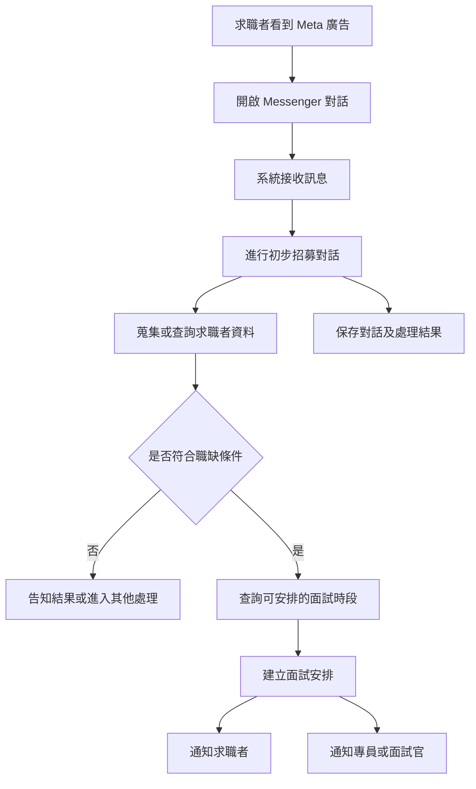

# AI 招募對話與面試預約系統 Discovery Baseline

> 文件編號：AIR-DISC-001  
> 版本：v0.1 Draft  
> 狀態：Draft  
> 最後更新：2026-07-30

---

# 1. 文件目的

本文件依目前既有流程圖與初步討論整理專案基準，用於區分已知資訊、解決方案假設、待確認事項、初步風險與後續 Discovery 訪談方向。

本文件不代表需求已正式確認，也不作為固定總價或正式驗收依據。

---

# 2. 暫定專案描述

建立一套以 Meta 廣告與 Messenger 為求職者入口的招募自動化服務。

系統預計透過自動對話蒐集求職者資料、進行初步職缺適配判斷，將對話與人才資訊保存至人才庫；符合條件者再依可用時段安排面試，並通知求職者及招募專員或面試相關人員。

---

# 3. 目前可識別的利害關係人

| 角色 | 初步責任 | 狀態 |
|---|---|---|
| 求職者 | 點擊廣告、進入對話、提供資料及選擇面試時段 | 圖面明確出現 |
| 招募專員 | 接收候選人、確認或處理面試 | 圖面明確出現，責任待確認 |
| 面試官 | 提供可用時段並執行面試 | 可能與專員相同，待確認 |
| 系統管理者 | 管理職缺、人才資料、流程與異常 | 合理推定 |
| 招募主管 | 定義篩選條件並查看成果 | 合理推定 |
| 廣告投放人員 | 管理 Meta 廣告與導流入口 | 合理推定 |
| 客戶公司 | 若專案屬於人力仲介服務，可能為職缺委託方 | 待確認 |
| 個資、法務或資安角色 | 確認個資蒐集、使用、保存與刪除規則 | 待確認 |

---

# 4. 初步端到端流程

目前流程缺口包括：

- 不符合條件後的處理未定義。
- 面試安排前是否需要人工核准未定義。
- 人才庫建立、查詢與更新時點未定義。
- 面試改期、取消、未回覆及未出席流程未定義。
- AI 無法判斷或求職者要求真人時的處理未定義。

---

# 5. 目前已知的業務需求候選

下列項目來自既有流程圖與初步說明，暫列為 Proposed，不視為 Confirmed：

- 求職者可由 Meta 廣告進入 Messenger 對話。
- 系統可接收並回覆 Messenger 訊息。
- 系統可進行初步招募對話。
- 系統可蒐集或整理求職者資料。
- 系統可依職缺條件產生初步適配結果。
- 系統可保存對話與人才資料。
- 系統可查詢面試可用時段。
- 系統可建立面試預約。
- 系統可通知求職者與專員或面試官。

---

# 6. 解決方案候選

下列內容目前只視為技術候選，不固定為正式需求：

| 候選方案 | 治理方式 |
|---|---|
| Make 或 n8n | 流程自動化平台候選 |
| Claude API 或其他模型 | AI 對話與資料整理服務候選 |
| Meta App 與 Webhook | Messenger 整合方式候選 |
| Tool Use | AI 呼叫系統能力之實作模式候選 |
| LINE 或 Email | 通知管道候選 |
| Prompt | AI 行為控制方式候選 |

正式需求應描述系統能力與業務結果，不應在 Discovery 未完成前固定特定產品。

---

# 7. 初步專案邊界

## 7.1 PoC 候選邊界

- 單一公司。
- 單一 Meta 粉絲專頁。
- 繁體中文。
- 1 至 3 個測試職缺。
- 基本招募對話與資料蒐集。
- 明確條件式初步篩選。
- 基本人才能資料保存。
- 單一行事曆來源。
- Messenger 與 Email 基本通知。
- 極簡管理頁面。

## 7.2 MVP 候選邊界

- 多職缺管理。
- 候選人狀態管理。
- 人工覆核與人工接手。
- 基本角色權限。
- 面試改期、取消與提醒。
- 個資告知與同意紀錄。
- 操作、對話、篩選與預約歷程。
- 外部服務失敗處理。
- 基本統計、備份與監控。

## 7.3 暫不納入候選

- 多租戶 SaaS。
- 多公司與多品牌共用。
- 完整 ATS 或 HR 系統。
- 履歷 OCR 與複雜欄位辨識。
- 多語言。
- 語音或視訊面試。
- 情緒、人格或影像分析。
- AI 自動做最終錄取或淘汰決策。
- 客製模型訓練與準確率保證。
- 高可用、災難復原、正式滲透測試與 24 小時 SLA。

---

# 8. 主要待確認事項

1. 系統由單一企業、仲介公司、獵頭公司或 SaaS 業者使用。
2. 求職者應徵的是系統持有者自己的職缺或客戶委託職缺。
3. 專員、面試官與排程負責人的角色關係。
4. AI 篩選結果是否可直接開放預約。
5. 每個職缺的必要條件、加分條件與淘汰條件。
6. 黑名單或不適任名單的來源、權限與治理方式。
7. 對話採固定問卷、自由對話或混合模式。
8. 求職者中斷、重複進入、修改答案或要求真人的處理。
9. 人才庫為新建資料庫或既有 ATS、CRM。
10. 求職者重複資料的辨識與合併方式。
11. 面試行事曆採 Google Calendar 或 Microsoft 365。
12. 求職者選時段、系統指定或人工核准的流程。
13. 通知管道與通知對象。
14. 個資告知、同意、保存期限、更正與刪除規則。
15. 預估使用人數、職缺數、訊息量與候選人資料量。

---

# 9. 初步風險

| 風險 | 初步影響 |
|---|---|
| Meta App 權限或審核時程不確定 | 可能延誤整合與測試 |
| 招募規則未明確 | AI 對話與篩選無法驗收 |
| 將重要決策完全交由生成式 AI | 結果不穩定且難以稽核 |
| 人才資料涉及個資 | 需定義告知、權限、保存及刪除 |
| 對話中斷與非預期回答 | 需建立狀態保存與復原機制 |
| 行事曆時段競爭 | 需在預約建立時再次檢查衝突 |
| 第三方服務中斷或限流 | 需建立錯誤紀錄、重試與人工處理 |
| PoC 與正式營運邊界不清 | 容易產生範圍與驗收爭議 |

---

# 10. 下一輪 Discovery 問題

1. 這套系統由誰使用及付費？
2. 求職者應徵的是誰的職缺？
3. 圖中的專員實際是什麼角色？
4. AI 初篩後是否需要人工核准？
5. 第一階段最重要的驗證目標為何？
6. 現有 Meta、Messenger、行事曆、人才庫與通知帳號有哪些？
